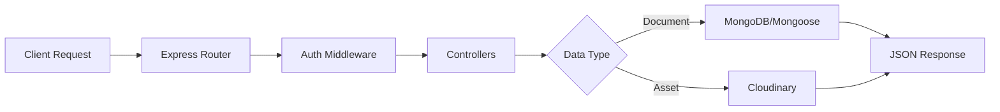

# ⚙️ CodeCraft Backend Core


The **CodeCraft Backend Core** provides the central API services for the hackathon platform. It handles data persistence via MongoDB, asset management through Cloudinary, and orchestrates the complex logic required for hackathon phases and registrations.

---

## 🛠️ Tech Stack

- **Framework**: Express 5 (Next-gen web framework)
- **Database**: MongoDB (via Mongoose ODM)
- **Storage**: Cloudinary (Image & Asset hosting)
- **Middleware**: CORS, Dotenv, JSON Parser
- **Runtime**: Node.js (CommonJS)

---

## 📂 Repository Structure

| Path | Purpose |
| :--- | :--- |
| `src/server.js` | Entry point & Server initialization |
| `src/routes/` | API route definitions (Hackathons, Registrations, Users) |
| `src/models/` | Mongoose schemas for data modeling |
| `src/controllers/` | Business logic implementation |
| `src/middleware/` | Custom middleware for Auth, Validation, etc. |
| `src/config/` | Configuration for Cloudinary, MongoDB, and Firebase |

---

## 🔄 Way of Working (Logic Flow)



---

## 🚀 Getting Started

1. **Environment Config**:
   Create a `.env` file with:
   - `MONGODB_URI`
   - `CLOUDINARY_URL`
   - `FIREBASE_ADMIN_CONFIG`

2. **Install Dependencies**:

   ```bash
   npm install
   ```

3. **Development Mode**:

   ```bash
   npm run dev
   ```

4. **Production Start**:

   ```bash
   npm start
   ```
