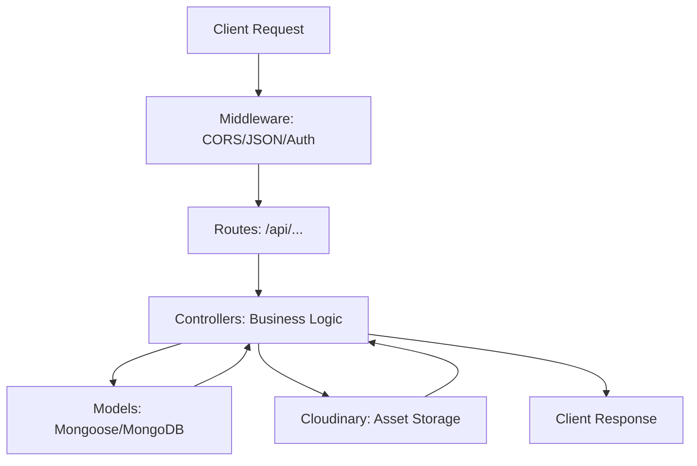

# 🚀 CodeCraft Backend

The core API service for the CodeCraft Hackathon Management Platform. Built with Express.js and Mongoose, providing a robust RESTful architecture for user management, hackathon orchestration, and registration workflows.


---

## 📂 Project Structure

| Path | Description |
| :--- | :--- |
| `src/server.js` | Entry point of the application. |
| `src/config/` | Database and third-party service configurations. |
| `src/controllers/` | Request handlers and business logic. |
| `src/models/` | Mongoose schemas and data models. |
| `src/routes/` | API route definitions. |
| `src/middleware/` | Global and route-specific middlewares (Auth, Error). |

---

## 🛠️ Way of Working (Logic Flow)



---

## ⚡ Quick Start

1. **Install Dependencies**

   ```bash
   npm install
   ```

2. **Environment Setup**

   Create a `.env.local` file in the root directory:

   ```env
   PORT=5000
   MONGO_URI=your_mongodb_uri
   CLOUDINARY_URL=your_cloudinary_url
   ```

3. **Run Development Server**

   ```bash
   npm run dev
   ```

---

## 📡 API Endpoints

- `GET /api/users`: User management.
- `GET /api/hackathons`: Hackathon configuration and lifecycle.
- `GET /api/registrations`: Registration and submission handling.
